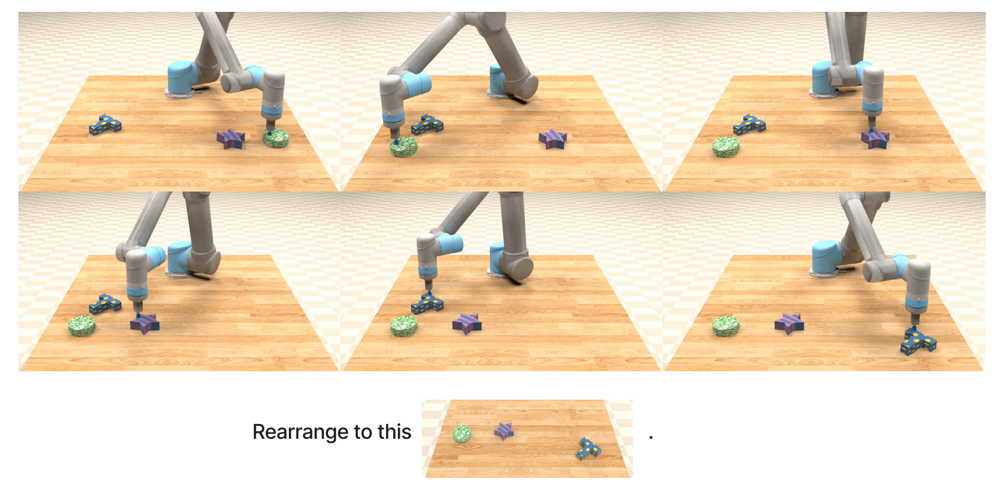
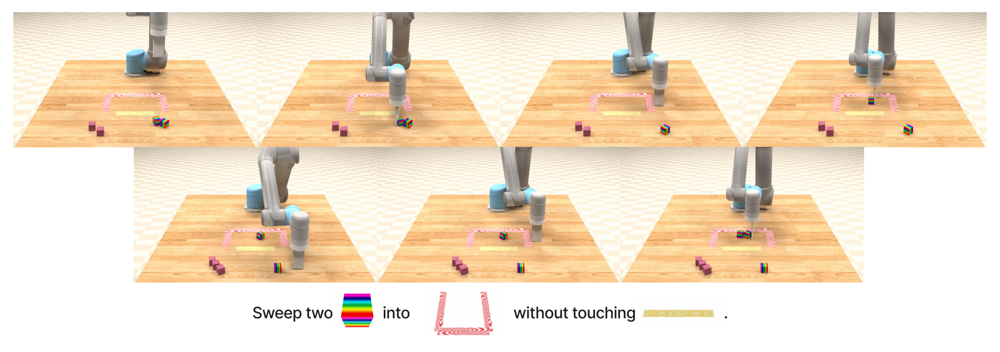

# Dataset Card for VIMA-Data

## Table of Contents
- [Table of Contents](#table-of-contents)
- [Dataset Description](#dataset-description)
  - [Dataset Summary](#dataset-summary)
- [Dataset Structure](#dataset-structure)
- [Dataset Creation](#dataset-creation)
- [Additional Information](#additional-information)
  - [Licensing Information](#licensing-information)
  - [Citation Information](#citation-information)

## Dataset Description

- **Homepage:** https://vimalabs.github.io/
- **Repository:** https://github.com/vimalabs/VimaBench
- **Paper:** https://arxiv.org/abs/2210.03094

### Dataset Summary

This is the official dataset used to train general robot manipulation agents with multimodal prompts, as presented in [paper](https://arxiv.org/abs/2210.03094). It contains 650K trajectories for 13 tasks in [VIMA-Bench](https://github.com/vimalabs/VimaBench). All demonstrations are generated by oracles.

## Dataset Structure

There are three major fields in each data sample: `observation`, `action`, and `multimodal_instruction` as well as its asset `multimodal_instruction_assets`.
The field `observation` stores agents' observations, including visual observations (RGB and matched segmentation) from frontal and top-down views and the type of the end-effector.
The field `action` stores ground-truth action labels. Here we use two high-level primitive actions ("pick-and-place" and "sweep"). Each action label consists of the starting and ending poses for these two primitives.
Fields `multimodal_instruction` and `multimodal_instruction_assets` store multi-modal prompts (interleaved texts and images).
More details and examples can be found [here](https://github.com/vimalabs/VimaBench#training-data).

## Dataset Creation

All demonstrations are generated by scripted oracles.

## Visualization
Here we visualize two trajectories with their multi-modal prompts from tasks "Visual Goal Reaching: Rearrange then Restore" and "Visual Constraint Satisfaction: Without Touching".






### Licensing Information

This dataset is released under the [Creative Commons Attribution 4.0 International (CC BY 4.0)](https://creativecommons.org/licenses/by/4.0/legalcode) license.

### Citation Information

If you find our work useful, please consider citing us! 

```bibtex
@inproceedings{jiang2023vima,
  title     = {VIMA: General Robot Manipulation with Multimodal Prompts},
  author    = {Yunfan Jiang and Agrim Gupta and Zichen Zhang and Guanzhi Wang and Yongqiang Dou and Yanjun Chen and Li Fei-Fei and Anima Anandkumar and Yuke Zhu and Linxi Fan},
  booktitle = {Fortieth International Conference on Machine Learning},
  year      = {2023}
}
```